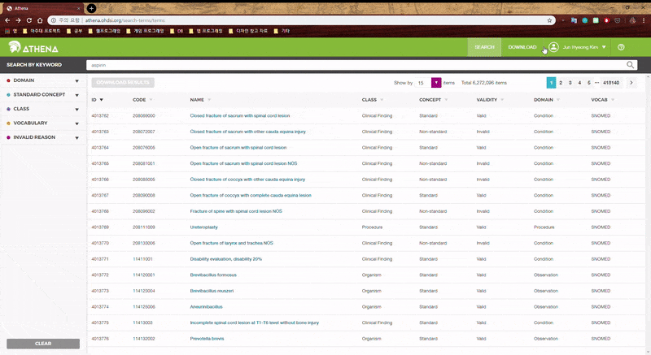
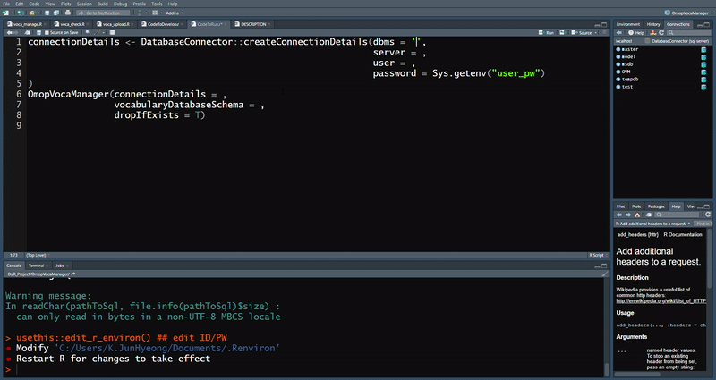

# OmopVocaManager


# Introduction

Omop Vocabulary Manager (OmopVocaManger) is tool for uploading athena vocabulary data to DBMS server. 

# Features

- It needs vocabulary files in folder.
- If you have no tables in dbms, it can create tables using ddl file.

# Download Vocabulary

- Download vocabulary in athena.



# How to use

In R, to install package, typing this code
```
install.packages("devtools")
library(devtools)
install_github("ABMI/OmopVocaManager")
```

After install, you can use OmopVocaManager.
```
library(OmopVocaManager)
connectionDetails <- DatabaseConnector::createConnectionDetails(dbms = <dbms server>,
					   			server = <ip address>,
					   			user = <user id>,
					   			password = <user password>)
OmopVocaManager(connectionDetails = connectionDetails,
		oracleTempSchema = <oracle temp schema>
		vocabularyDatabaseSchema = <schema>,
		dropIfExists = F)
```
If you have already tables, 'dropIfExists = T' can drop the tables for create new tables.


